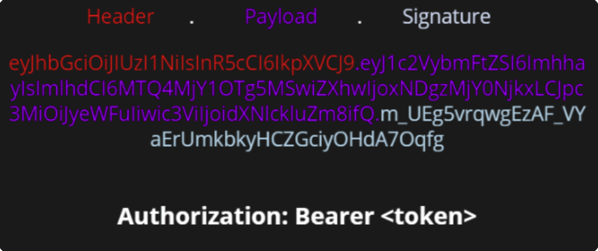

# JWT

## JWT란?
> `JWT` 란 `JSON Web Token` 이라는 뜻으로 `JSON` 포맷을 이용하여 사용자에 대한 속성을 저장하는 `Claim` 기반의 `Web Token` 이다.

## JWT의 구조
> `JWT`의 구조는 크게 3가지로 나누어 진다.

- Header
- Payload 
- Signature

**Header**
> `Header` 는 `typ` 과 `alg` 두 가지 정보로 구성된다.
- typ : 토큰의 타입을 지정 
- alg : 알고리즘의 방식을 지정, 서명 및 토큰 검증에 사용

```
{ 
    "alg": "HS256",
    "typ": JWT 
}
```

**Payload**
> `페이로드` 에는 `토큰` 에서 사용할 정보의 조각들인 `클레임` 이 담겨 있다. 

> `클레임` 은 총 3가지로 나누어지며, `Json` 형태로 정보를 넣을 수 있다.

**Signatur**
> `Signature` 는 토큰을 인코딩하거나 유효성 검증을 할 때 사용하는 고유한 암호화 코드이다.

> `Signature` 은 각각의 `Header` 와 `Payload` 의 값을 인코딩하고, 인코딩한 값을 비밀 키를 이용해 `Header` 에서 정의한 알고리즘으로 해싱을 하고, 이 값을 다시 인코딩하여 생성한다.

**예시**


---

**출처 : https://mangkyu.tistory.com/56**