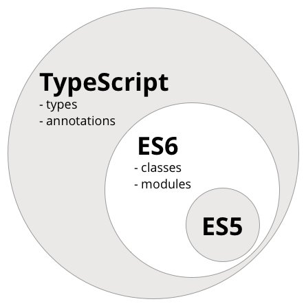

# Typescript 🔎

## 설명 🔎

**Typescript란?**
> 타입스크립트는 자바스크립트에 타입을 부여한 언어이다. 즉 자바스크립트의 확장된 언어라고 볼 수 있다.


---

## 설치 🔎
> 다음 코드를 입력하여 디렉터리 내부에 `package.json` 파일을 설치한다.
```
$ mkdir ts-practice
$ cd ts-practice 
$ yarn init -y
```

> 이젠 타입스크립트 설정파일인 `tsconfig.json` 을 프로젝트 내부에 설치해야 한다.
```
$ yarn global add typescript
```
> 먼저 `Typescript` 를 글로벌로 설치해준다. 그 후 디렉터리 내부에 `tsc --init` 명령어를 입력하면  `tsconfig.json` 이 자동생성된다.  
---

## 기본 타입 🔎
> 먼저 코드를 작성해준다.
```javascript
let count = 0; // 숫자
count += 1;
count = '갑자기 분위기 문자열'; // 에러

const message: string = 'hello world'; // 문자열

const done: boolean = true; // 불리언 값

const numbers: number[] = [1, 2, 3]; // 숫자 배열
const messages: string[] = ['hello', 'world']; // 문자열 배열

messages.push(1); // 숫자 넣으려고 하면 안됨

let mightBeUndefined: string | undefined = undefined; // string 이거나 undefined
let nullableNumber: number | null = null; // number 이거나 null 

let color: 'red' | 'orange' | 'yellow' = 'red'; // red, orange, yellow 중 하나
color = 'yellow';
color = 'green'; // 에러
```
> TypeScript 를 사용하면 이렇게 특정 변수 또는 상수의 타입을 지정 할 수 있고 우리가 사전에 지정한 타입이 아닌 값이 설정 될 때 바로 에러를 발생시킨다.
---

## 인터페이스
> Typescript의 핵심 원칙은 값의 형태에 초점을 맞추고 있다는 것이다. Typescript에서 인터페이스는 이런 타입들의 이름을 짓는 역할을 해준다.

**인터페이스**
```javascript
function printLabel(labeledObj: { label: string }) {
    console.log(labeledObj.label);
}

let myObj = {size: 10, label: "Size 10 Object"};
printLabel(myObj);
```
> 위의 예제를 인터페이스를 사용하면 및의 예제로 작성할 수 있다.

```javascript
interface LabeledValue {
    label: string;
}

function printLabel(labeledObj: LabeledValue) {
    console.log(labeledObj.label);
}

let myObj = {size: 10, label: "Size 10 Object"};
printLabel(myObj);
```
> 이 예시와 같이 인터페이스는 타입을 미리 선언을 해준다고 할 수 있다.

**선택적 인터페이스**
> 인터페이스의 프로퍼티에 조건을 넣어줄 수 있는데 이것을 선택적 인터페이스라고 한다.

```
interface SquareConfig {
    color?: string;
    width?: number;
}
```
> 이런식으로 `?` 를 붙이면 `color` 의 값이 `string` 일수도 아닐수도 있다.
---

### 피드백은 언제나 환영입니다! 😇
### 오타나 코드에 오류가 있으면 issue를 남겨주세요! 😁
### 출처 : 패스트캠퍼스 강의 - 벨로퍼트와 함께하는 React Router